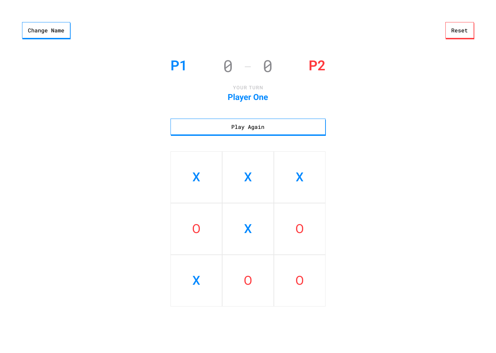

# Tic Tac Toe - The Odin Project

## Description

Tic Tac Toe game made using OOP paradigm.
[Play game.](https://xnaavii.github.io/the-odin-project--tic-tac-toe/)

- Figma design

  

## Features

- Play game
- Display turn information
- Increment player score
- Change player name
- Reset game

## What I learned

I learned how to separate concerns of objects to have cleaner code.

### Stack

- HTML
- CSS
- JS
